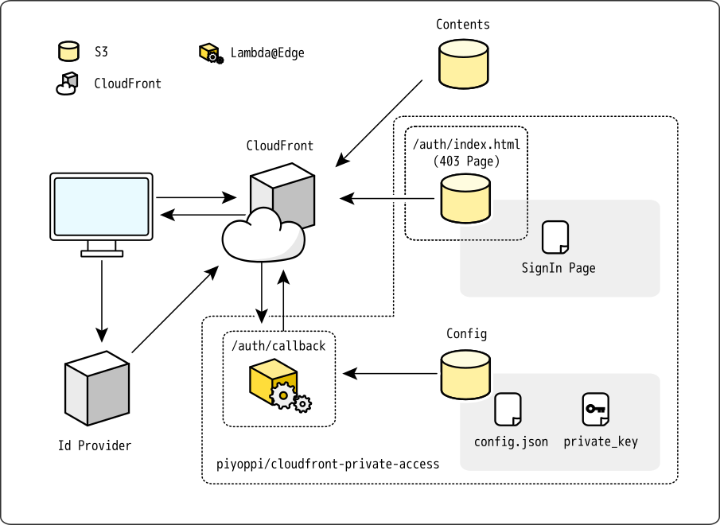

# cloudfront-private-access

Tools to add authentication to pages delivered via CloudFront.



## Usage

### Deployment

Set up with the following commands.

```sh
./bin/setup.sh -b <bucket-name-prefix>
```

Build with the following command. To set parameters, run with --guided options for the first time.

```sh
sam build --guided --beta-features
```

If the `samconfig.toml` file exists, it can be build with the following command.

```sh
sam build --beta-features
```

Deploy with the following command.

- Two buckets (<bucket-name-prefix>-config, <bucket-name-prefix>-staticpage will be created.
- A lambda function is created.

```sh
sam deploy
```

### Key registration

Signing keys for CloudFront can be generated with the following command.

```sh
openssl genrsa -out private_key.pem 2048
openssl rsa -pubout -in private_key.pem -out public_key.pem
```

Upload the key to be signed by the function.

```sh
./bin/upload-key.sh <key-file-name>
```

### Configuration

Edit `config/config.json`.

```js
{
  "keyPairId": "XXXXXXX",                               // Cloudfront Public Key Id
  "cloudFrontUrl": "https://xxxxxxxxx.cloudfront.net",  // Cloudfront URL
  "authIssuerClientId": "xxxxxxxx",                     // Issuer client id
  "uid": [                                              // Allowed user IDs
    "account@example.com"
  ]
}
```

Upload `config/config.json` with the following command.

```sh
./bin/upload-config.sh
```
